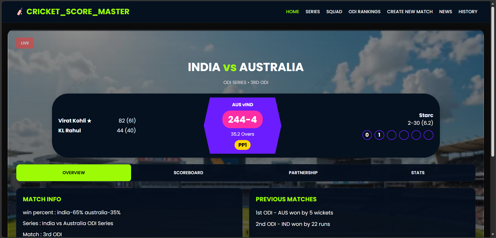
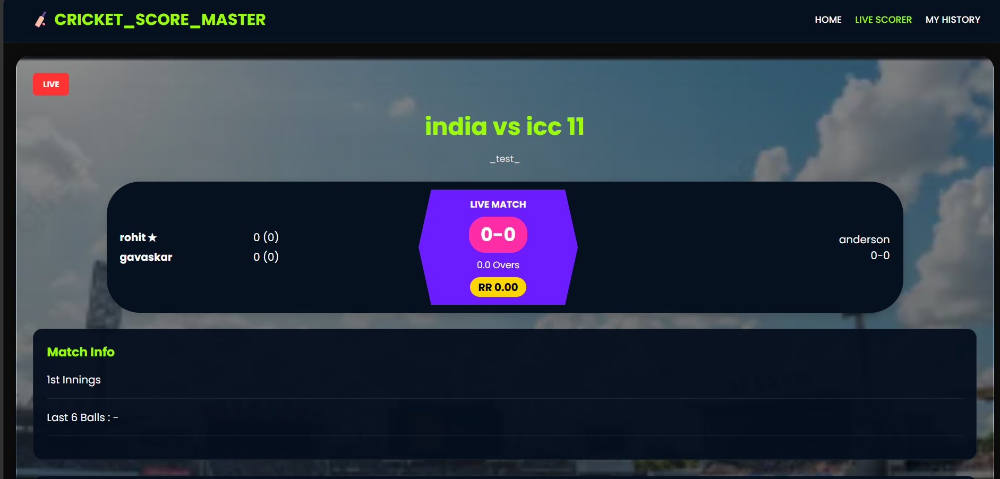
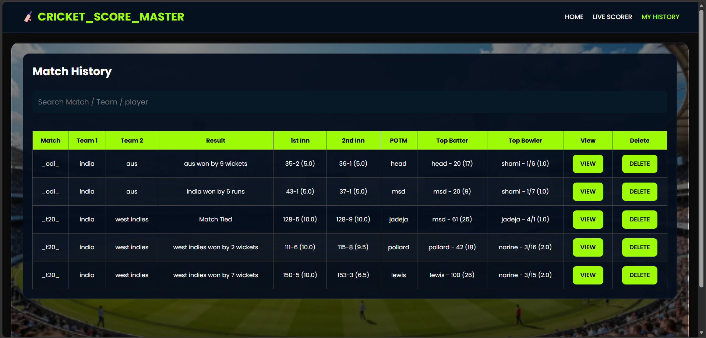
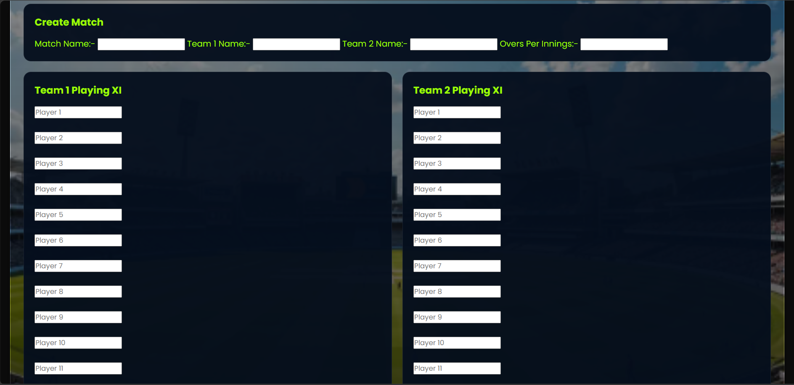
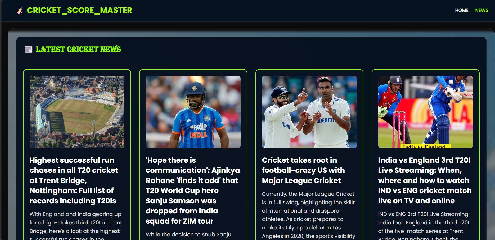

# 🏏 Cricket Score Master

Cricket Score Master is a complete cricket scoring web application developed using HTML, CSS and JavaScript.

It allows users to create cricket matches, score them ball-by-ball, save completed matches, view scorecards, search match history and read the latest live cricket news.## 🌟 Project Preview

A modern cricket scoring application built using HTML, CSS and JavaScript with live scoring, match history, detailed scorecards and live cricket news powered by NewsAPI.

---

## ✨ Features

- 🏏 Create Cricket Matches
- 👥 Add Playing XI
- 🎯 Live Ball-by-Ball Scoring
- 📊 Automatic Scoreboard Updates
- 🏆 Player of the Match Selection
- 📈 Detailed Match Scorecards
- 💾 Save Match History
- 🔍 Search Matches by Team, Player or Match Name
- 🗑 Secure Match Deletion
- 📰 Latest Live Cricket News (NewsAPI)
- 📱 Fully Responsive Design
---

## 🛠 Technologies Used

- HTML5
- CSS3
- JavaScript (ES6)
- NewsAPI

---

## 📂 Project Structure

## 📂 Project Structure

```
CRICKET_SCORE_MASTER
│
├── assets/
├── css/
│   └── style.css
│
├── js/
│   ├── script.js
│   ├── livescorer.js
│   ├── history.js
│   ├── matchdetails.js
│   └── news.js
│
├── screenshots/
│   ├── home.png
│   ├── history.png
│   ├── livescorer.png
│   ├── matchdata.png
│   └── news.png
│
├── index.html
├── history.html
├── livescorer.html
├── matchdetails.html
├── news.html
├── odi1.html
├── odi2.html
├── odi4.html
├── odi5.html
├── SCORER.HTML
│
└── README.md
```
---

## 🚀 How to Run

1. Download or clone the project.
2. Open the project in Visual Studio Code.
3. Install the **Live Server** extension.
4. Right-click `index.html`.
5. Click **Open with Live Server**.
6. Enjoy Cricket Score Master!

---

## 📸 Screenshots

### 🏠 Home Page



---

### 🏏 Live Scorer



---

### 📜 Match History



---

### 📊 Match Details



---

### 📰 Cricket News


---

## 👨‍💻 Developed By

**Yugaant Jain**

---

## 📄 License

This project is created for educational and learning purposes.
